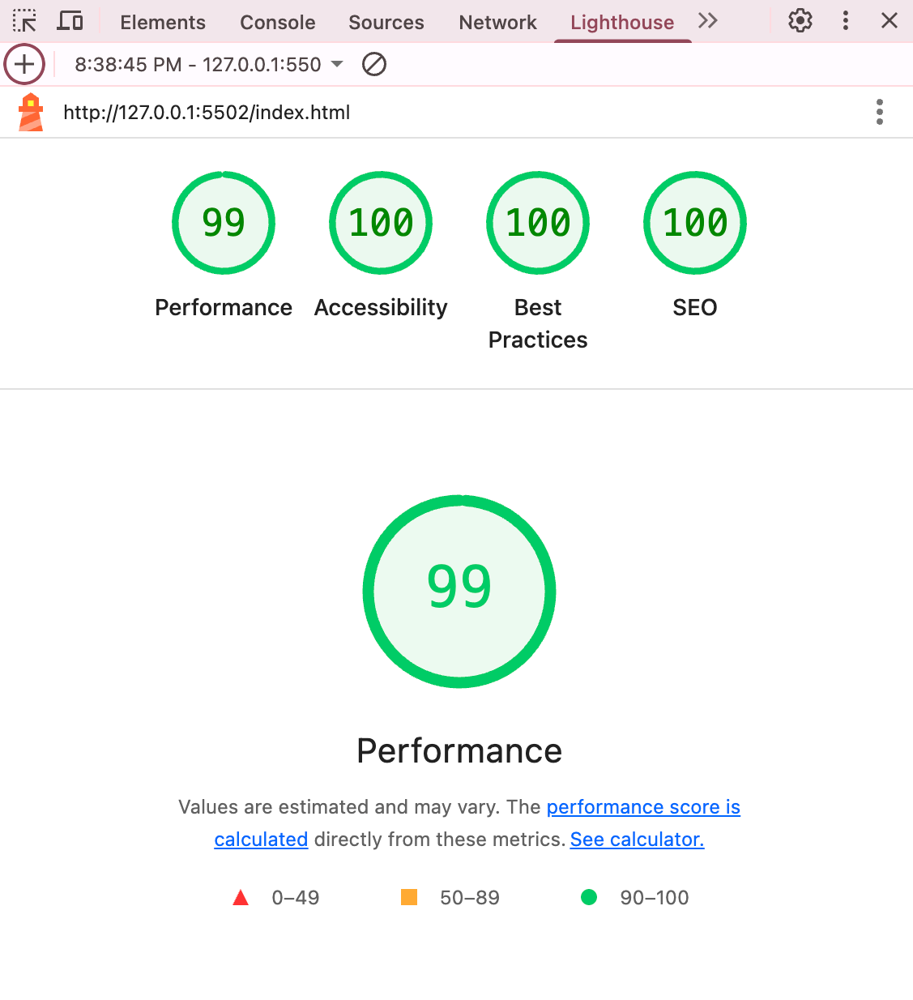

# Emoji Quiz App

## Team Members

- Magdalena Rios
- Yasmin Jama
- Anastasiia Skachenko
- Negar Baharmand
- Hugo Oblak

🔗 **Live Demo:** [https://u03quizproject.netlify.app/](https://u03quizproject.netlify.app/)

## About the Project

An interactive quiz application where users can test their knowledge by guessing movies, songs, or programming concepts from emojis, quotes, or lyrics. Users compete for high scores on the leaderboard while racing against the clock!

### Core Functionality
- 🎬 **Multiple quiz categories** (Movies, Music, Programming)
- 🎯 **Different quiz types** (Emojis, Quotes, Lyrics, Easy, Hard)
- ⏱️ **Timer tracking** for each question (30 seconds per question)
- 🏆 **Score calculation** based on speed and accuracy
- 📊 **Progress tracking** (Question 1/10)
- 💡 **Hint system** (3 hints per quiz)
- ⚡ **Strike tracking** (penalties for wrong answers)
- 🥇 **Leaderboard** with top scores
- 💾 **User data storage** with Supabase
- 📱 **Responsive design** (Mobile, Tablet, Desktop)

### Quiz Categories
1. **Movies** - Disney classics, Action films, Sci-Fi, Rom-Coms
2. **Music** - Guess songs from lyrics or artist clues
3. **Programming** - Test your coding knowledge

## Tech Stack

- HTML5
- CSS3
- Vanilla JavaScript (ES6+)
- Supabase (Database)
- LocalStorage (Timer data)

## Performance Evaluation

### Lighthouse Scores

| Category | Score |
|----------|-------|
| Performance | 99/100 ✅ |
| Accessibility | 100/100 ✅ |
| Best Practices | 100/100 ✅ |
| SEO | 100/100 ✅ |

### Performance Optimizations

1. ✅ Added `defer` attribute to all script tags
2. ✅ Moved all scripts to bottom of HTML body
3. ✅ Added `loading="lazy"` to all images
4. ✅ Added meta viewport tag for mobile responsiveness
5. ✅ Added meta description for SEO

## SEO Implementation

### Technical SEO
1. ✅ **Meta Tags**
   - Viewport meta tag for mobile responsiveness
   - Description meta tag for search results preview
   - Language attribute set to English (`lang="en"`)
     
2. ✅ **Semantic HTML**
 - Proper HTML5 structure (`<header>`, `<main>`, `<section>`)
   - Correct heading hierarchy (h1, h2, h3)
   - Meaningful element names
     
3. ✅ **Image Optimization**
   - Alt text and lazy loading

4. ✅ **robots.txt**
   - Created robots.txt to guide search engine crawlers
   - Allows indexing of all pages

5. ✅ **Valid HTML**
   - ✅ **0 errors** on [W3C HTML Validator](https://validator.w3.org/)
   - ✅ **0 warnings**
   - Standards-compliant code

6. ✅ **Clean Console**
   - ✅ **0 errors** in browser console
   - ✅ **0 warnings**
   - Proper error handling
  
     
  ### Google Analytics

#### Navigation & Selection
- `select_content` (category) - When user selects quiz category (Movies, Music, Coding)
- `select_content` (difficulty) - When user selects difficulty/type (Emojis, Quotes, Lyrics, Easy, Hard)

#### Quiz Lifecycle
- `quiz_start` - When user starts a quiz
- `answer_selected` - When user submits an answer (includes question_id, correct/incorrect)
- `hint_used` - When user clicks hint button
- `hint_unavailable` - When user attempts to use hint with none remaining
- `quiz_completed` - When user finishes all 10 questions (includes score, correct answers)
- `quiz_quit` - When user exits quiz mid-game (includes dropout point, progress)
- `play_again` - When user restarts quiz after completion

### Insights
- Track which quiz categories and difficulties are most popular
- Monitor completion rates and identify dropout points
- Analyze question difficulty (detect problematic questions)
- Measure hint system effectiveness
- Optimize quiz length based on quit patterns
- Understand user engagement and replay behavior
- Data-driven content strategy decisions

   

## Development

We use feature branches and pull requests for code reviews before merging to main.
